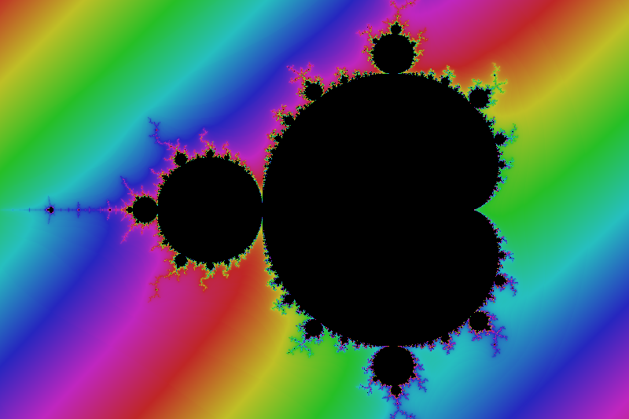
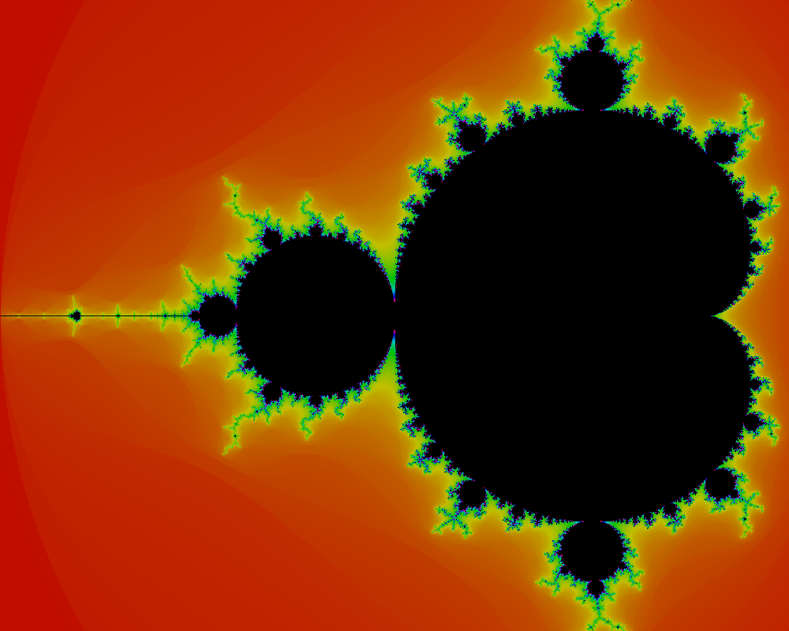
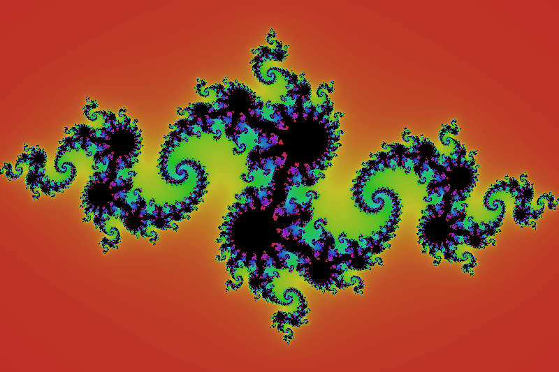
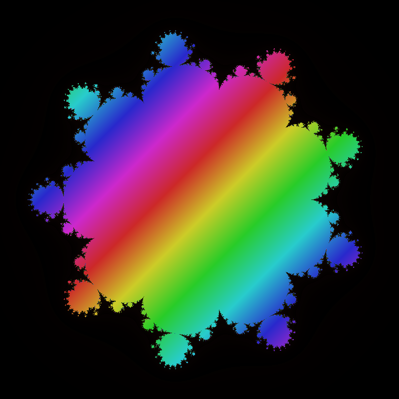

# Fractals (GTK)

An interactive fractal generator written in **C** using the **GTK+3** graphics toolkit.

This application allows the user to render and explore a variety of fractals including the **Mandelbrot set**, **Julia sets**, and other fractals generated from user-defined complex functions. The program provides an interactive GUI for adjusting parameters, colors, and rendering options.

---

## Example Fractals

| Mandelbrot | Julia |
|-------------------------|-------------------------|
|  |  |

| Rainbow Mandelbrot | Reversed Generic Fractal |
|-------------------------|-------------------------|
|  |  |

---

## Example Animations

Zoom into the Mandelbrot set:

[Mandelbrot Zoom](movies/fractal_movie_1.mp4)

Fractal from Newton's Method:

[Newton-Raphson Animation](movies/fractal_movie_2.mp4)

---

## Features

- Interactive GUI built with **GTK+3**
- Render **Mandelbrot and Julia sets**
- Support for **custom complex functions**
- Multiple coloring modes
- Adjustable iteration limits and zoom levels
- Real-time rendering updates
- Ability to generate fractal animations

---

## Building the Program

### Requirements

- GCC
- GTK+3 development libraries
- pkg-config
- Linux environment (tested on Linux)

### Build

Clone the repository and run: `make`

This will produce the executable: `Fractals`

## Running

`./Fractals`

The graphical interface will open and allow you to select fractal types and rendering options.

---

## Custom Functions

The program allows user-defined complex functions for generating fractals.

⚠️ **Warning:**  
Custom functions are compiled dynamically. Invalid or unsafe code may cause crashes or unexpected behavior.

This feature is intended for users comfortable editing C code.

---

## License

This project is released under the MIT License.
